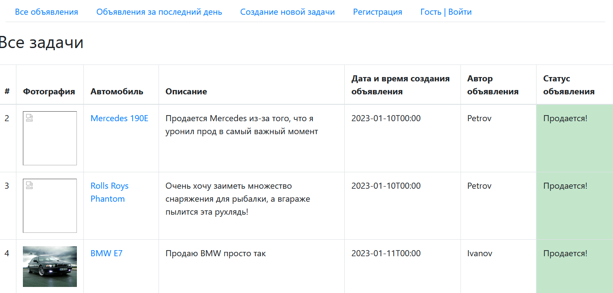
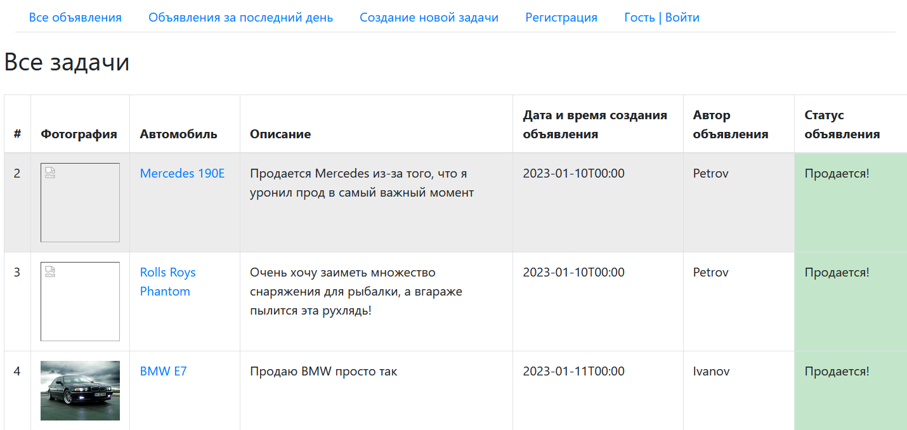
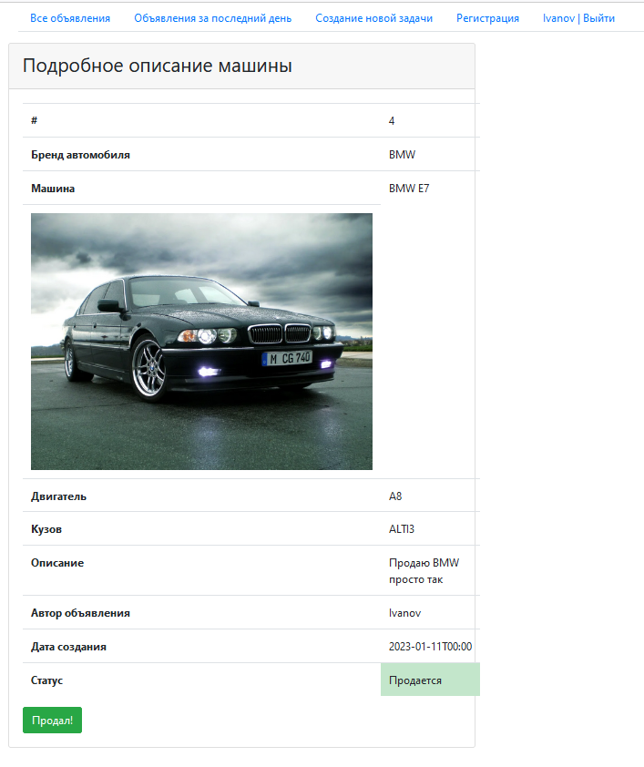

# Проект Job4j_cars
## Сервис для продажи автомобилей
### Стек технологий 
- Java 17.0.2
- Maven 3.8.5
- Spring boot 2.7.3

- Hibernate 5.6.11 final
- Liquibase 4.15.0
- Thymeleaf
- Bootstrap

### Запуск приложения:

Для запуска проекта потребуется:
- Java 8 и выше
- Maven 3.8,
- PostgresSQL 14

Создаем базу данных командой
```shell
create database cars;
```
Создаем таблицы с помощью Liquibase, далее производим запуска самого приложения командой
```shell
mvn spring-boot:run
```

### Как использовать? 
Есть два вида. Все объявления:

И объявления за последний день

(Они правда работают, просто день не прошёл :))

Детальное объявление, в котором можно рассмотреть характеристики автомобиля

Если пользователь текущий сессии является автором объявления, то он может закрыть его.

Контакты для связи kshift84@gmail.com